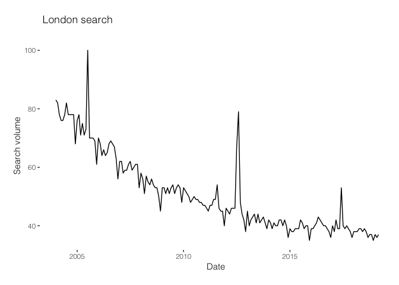
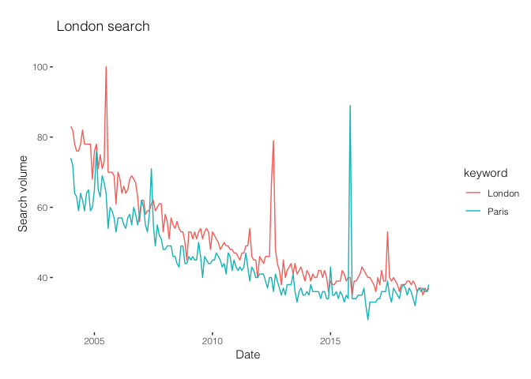

City Trends
================
Bernadeta
23/03/2019

Using gtrendsR package I can get all searches for term "London". Gprop allows to choose between "web", "news" , "images", "froogle", and "youtube" options.

``` r
google.trends <- gtrends(c("London"), gprop = "web", time = "all") #[[1]] using this would only take the 1st list
LondonDateHits <-as.data.frame(google.trends$interest_over_time)
ggplot(LondonDateHits, aes(date)) + 
  geom_line(aes(y = LondonDateHits$hits ))+
  labs(x = "Date \n", y = "\n Search volume ", title = "\n London search \n") +
  theme_tufte() +
  theme(text=element_text(family="Helvetica Light")) 
```



If I would like to include multiple cities on the same graph

``` r
google.trends <- gtrends(c("London", "Paris"), gprop = "web", time = "all") #[[1]] using this would only take the 1st list
LoPaDateHits <-as.data.frame(google.trends$interest_over_time)
ggplot(LoPaDateHits, aes(date, color=keyword)) + 
  geom_line(aes(y = LoPaDateHits$hits ))+
  labs(x = "Date \n", y = "\n Search volume ", title = "\n London search \n") +
  theme_tufte() +
  theme(text=element_text(family="Helvetica Light")) 
```



To create city polygons I use <http://polygons.openstreetmap.fr/index.py> . Go to open street map and get OSM ID for the city (e.g. 65606 for London), then go to the polygons page, type in the OSM ID into the search box and you'll get poly file that has x and y coordinates. I save that file as London.txt and plot with geom\_polygon

``` r
LondonMap <- read.delim("London.txt", header = TRUE, stringsAsFactors = FALSE)
ggplot(LondonMap, aes(x = x, y = y)) +
  geom_polygon() +
   theme_tufte() +
  theme(text=element_text(family="Helvetica Light")) 
```


